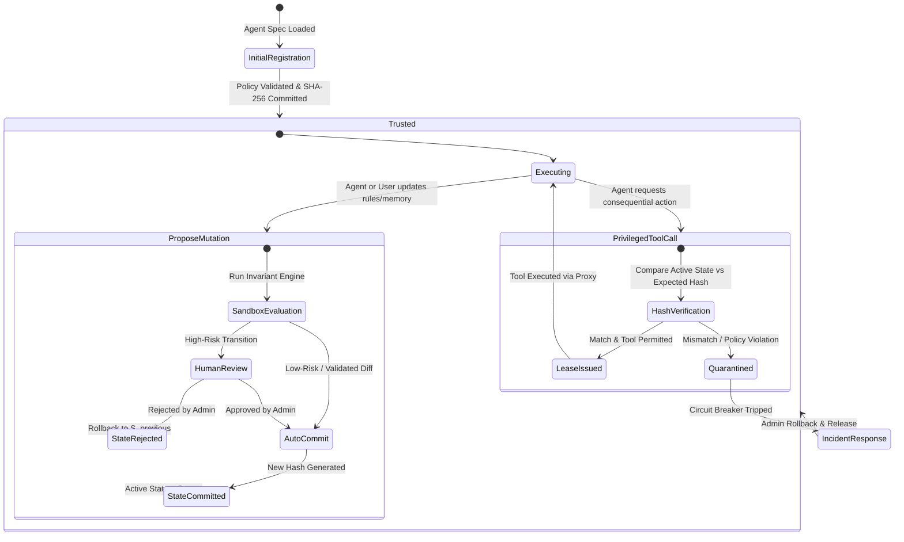
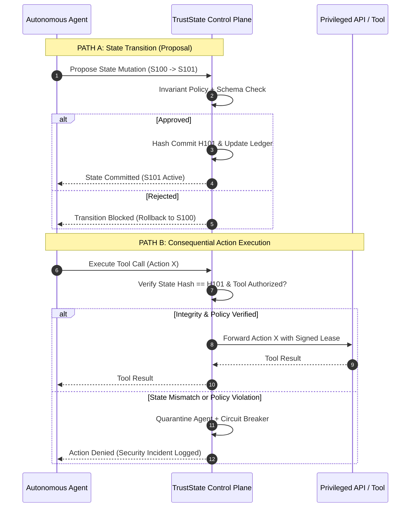

# TrustState — Product Requirements Document (PRD)

**Product:** TrustState  
**Tagline:** Zero-Trust Runtime Integrity for Autonomous AI Agents  
**Document Type:** 0→1 Product Requirements Document & Architecture Specification  
**Status:** Ready for Review / Prototype Phase  
**Version:** 2.0 (Hardened)  
**Author:** Product Management & AI Security Engineering  

---

## 1. Executive Summary

TrustState is a zero-trust runtime security control plane for autonomous, dynamic, and memory-retaining AI agents.

While conventional access control frameworks evaluate whether an agent has permission to execute an action (*"Can Agent X call API Y?"*), they cannot answer:

> **"Is Agent X still operating under the authorized, untampered execution state under which that permission was originally granted?"**

TrustState bridges this governance gap by enforcing a fundamental operating system principle:

> **The agent can propose a state change, but it cannot unilaterally make that state trusted.**

By decoupling **state proposal** from **state authorization**, TrustState allows autonomous agents to dynamically retrieve data, update long-term memories, and orchestrate complex workflows. TrustState is designed to prevent unauthorized state mutations from being used to trigger privileged execution.

---

## 2. Problem Statement & Enterprise Reality

### 2.1 The Evolution of AI Agents
Enterprise AI agents have transitioned from read-only conversational assistants to autonomous actors that execute consequential actions: modifying databases, triggering financial transactions, orchestrating CI/CD pipelines, and integrating with enterprise APIs via standards such as the Model Context Protocol (MCP).

In production, these agents:
1. **Maintain Long-Term Memory (LTM):** Dynamically storing and recalling user preferences, past interactions, and procedural rules.
2. **Ingest Untrusted Context:** Processing web pages, customer emails, third-party API payloads, and unverified documents via Retrieval-Augmented Generation (RAG).
3. **Execute Dynamic Workflow Routing:** Dynamically selecting which tools to invoke and altering execution paths based on intermediate outputs.
4. **Self-Tune & Optimize:** Refining prompts, few-shot examples, and parameters (e.g., DSPy-style prompt updates or automated task planners).

### 2.2 The Security Vulnerability: Runtime State Drift & Hijacking
Current security tools focus almost exclusively on **probabilistic text filtering** (input/output guardrails) or **static IAM roles** (API gateway access tokens). Both fail against state-level attacks:
- **Input Guardrails Fail:** Prompt injection cannot be reliably eliminated through text-layer classification alone. Attackers bypass classifiers using obfuscation, indirect injection, and multi-turn manipulation.
- **Static IAM Fails:** An agent granted database write permissions retains those permissions even if its working context or internal instructions have been hijacked by a malicious third-party document.

### 2.3 The Core Insight
Enterprises cannot treat an LLM as a trusted execution kernel. The agent runtime must be treated as an **untrusted user-space process**, while the state management and tool gating must operate as a **trusted kernel-space control plane**.

---

## 3. Product Thesis & Positioning

```text
┌────────────────────────────────────────────────────────────────────────┐
│                          THE TRUST BOUNDARY                            │
│                                                                        │
│   Traditional IAM / Gateway:                                           │
│   "Does Agent X have permission to call Tool Y?"                       │
│                                                                        │
│   TrustState Control Plane:                                            │
│   "Is Agent X's Protected Execution State (PES) cryptographically      │
│    intact and policy-compliant at the exact instant Tool Y is called?" │
└────────────────────────────────────────────────────────────────────────┘
```

> **Product Thesis:** Autonomous AI requires execution freedom, but autonomy without a verifiable trust boundary creates existential enterprise risk. TrustState establishes that boundary without degrading agent utility.

---

## 4. Target Personas

### 4.1 Primary Buyer & User: Enterprise AI Platform & AppSec Engineers
- **Role:** Staff Security Engineer, Head of AI Platform, Principal AppSec Architect.
- **Pain Point:** Cannot grant production tool permissions (SQL writes, SAP updates, Stripe refunds) to autonomous agents because a single indirect prompt injection could compromise enterprise systems.
- **Goal:** Provide provable, auditable runtime security guarantees to compliance and security leadership so that autonomous agents can safely reach production.

### 4.2 Secondary Stakeholders
- **AI Application Developers:** Need a simple, drop-in integration (MCP proxy or framework plugin) that does not break agent experimentation.
- **SOC / Incident Response Teams:** Need tamper-evident audit trails answering: *What state authorized this action? Who modified it? When did the compromise occur?*
- **Compliance & Risk Officers:** Require deterministic governance over autonomous system evolution under EU AI Act and NIST AI RMF frameworks.

---

## 5. Architectural Topology & Threat Boundary

To prevent compromised agent processes from spoofing verification, TrustState operates as an **Inline Control Proxy & Tool Gateway** with a decoupled **Authoritative Trust Store**.

```text
                         ┌─────────────────────────────────────────┐
                         │         UNTRUSTED EXECUTION DOMAIN      │
                         │                                         │
                         │             AUTONOMOUS AGENT            │
                         │       (LangGraph / CrewAI / AutoGen)    │
                         │    • Working Scratchpad & LLM Core      │
                         │    • Tool Selection & Planning          │
                         └───────────────────┬─────────────────────┘
                                             │
                       1. State Mutation /   │ 2. Tool Invocation
                          Memory Update      │    + State Attestation Token
                                             │
                                             ▼
  ═══════════════════════════════════════════╤══════════════════════════════════════
  TRUST BOUNDARY                            │  (Isolated Network / VPC)
  ═══════════════════════════════════════════╪══════════════════════════════════════
                                             ▼
                         ┌─────────────────────────────────────────┐
                         │         TRUSTSTATE CONTROL PLANE        │
                         │                                         │
                         │  ┌───────────────────────────────────┐  │
                         │  │ State Invariant & Policy Engine   │  │
                         │  │ • Deterministic schema checks     │  │
                         │  │ • Tool permission binding         │  │
                         │  │ • Sandbox → Commit Pipeline       │  │
                         │  └─────────────────┬─────────────────┘  │
                         │                    │                    │
                         │  ┌─────────────────▼─────────────────┐  │
                         │  │ Cryptographic State Ledger        │  │
                         │  │ • Canonical JSON normalization    │  │
                         │  │ • SHA-256 State Commitment        │  │
                         │  │ • Short-Lived Lease Token Minting │  │
                         │  └─────────────────┬─────────────────┘  │
                         │                    │                    │
                         │  ┌─────────────────▼─────────────────┐  │
                         │  │ Inline Tool Gateway / Proxy       │  │
                         │  │ • MCP / REST Enforcement          │  │
                         │  │ • Runtime State Attestation       │  │
                         │  │ • Circuit Breaker & Quarantine    │  │
                         │  └─────────────────┬─────────────────┘  │
                         └────────────────────┼────────────────────┘
                                              │
                                              ▼ 3. Verified Action
                                     ┌──────────────────┐
                                     │ PRIVILEGED TOOLS │
                                     │ Databases, APIs, │
                                     │ ERP, Slack, CRM  │
                                     └──────────────────┘
```

### 5.1 Root of Trust Guarantees
1. **No In-Process Blind Trust:** The agent does not self-report its validity. The TrustState gateway validates requests against cryptographic state records stored in the authoritative ledger.
2. **Short-Lived Cryptographic State Leases:** When a state is validated, TrustState issues a signed, time-bounded State Lease Token ($T_{lease}$):
   $$T_{lease} = \text{Sign}_{K_{TS}}(\text{AgentID}, \text{StateID}, \text{StateHash}, \text{AllowedTools}, \text{ExpiresAt})$$
   Privileged tools accept requests **only** when forwarded through the TrustState gateway bearing a valid lease token.

---

## 6. Multi-Tiered State Architecture (Solving Context Poisoning)

A critical vulnerability in naive state hashing is conflating conversational context with governance state. TrustState defines a precise three-tier state taxonomy:

```text
┌──────────────────────────────────────────────────────────────────────────────────┐
│                             AGENT STATE TAXONOMY                                 │
├──────────────────────┬────────────────────────┬──────────────────────────────────┤
│ State Tier           │ Contents               │ Governance & Hashing Model       │
├──────────────────────┼────────────────────────┼──────────────────────────────────┤
│ Tier 1: Protected    │ • System instructions  │ Cryptographically Hashed         │
│ Execution State      │ • Policy invariants    │ (SHA-256). Any change is a State │
│ (PES)                │ • Tool permissions     │ Transition requiring validation, │
│                      │ • Model/Temp config    │ schema checks, and commitment.   │
│                      │ • Workflow routing DAG │ Drift = Immediate Quarantine.    │
├──────────────────────┼────────────────────────┼──────────────────────────────────┤
│ Tier 2: Curated Long-│ • Agent persona        │ Governed via Sandbox → Commit    │
│ Term Memory (LTM)    │ • Learned preferences  │ Pipeline. Updates cannot contain │
│                      │ • Vector memory rules  │ instruction overrides or tool    │
│                      │ • Episodic knowledge   │ permission escalations.          │
├──────────────────────┼────────────────────────┼──────────────────────────────────┤
│ Tier 3: Ephemeral    │ • Chat turns           │ NOT hashed directly. Governed by │
│ Working Context      │ • Scratchpad thoughts  │ Runtime Policy Invariants at the │
│                      │ • Retrieved RAG chunks │ Tool Gateway (parameter & schema │
│                      │ • Raw tool outputs     │ validation).                     │
└──────────────────────┴────────────────────────┴──────────────────────────────────┘
```

### How this architecture limits the blast radius and impact of indirect prompt injection:
A malicious document can still influence an LLM's natural language reasoning. TrustState's role is not to police ephemeral thoughts, but to ensure that adversarial influence **cannot unilaterally become an authorized state change or privileged action**:

1. An attacker injects malicious instructions inside an external document or tool output (Tier 3).
2. The agent reads the text and attempts to either:
   - **Scenario A: Modify its own tools or governance rules.** It calls the state mutation interface. TrustState rejects the transition because Tier 1/2 policy invariants forbid prompt-directed permission elevation.
   - **Scenario B: Directly invoke a privileged tool outside its authorized policy.** The TrustState gateway intercepts the request, verifies that the active PES does not permit that action under current parameters, and trips the circuit breaker.
3. The malicious document cannot bypass the gateway because the LLM lacks the private key to sign lease tokens. State integrity remains intact.

---

## 7. State Lifecycle & Transitions



### 7.1 State Registration & Canonicalization
To avoid hash mismatches caused by key reordering or whitespace variations:
1. The state object is filtered to include only Tier 1 & approved Tier 2 attributes.
2. The object undergoes RFC 8785 JSON Canonicalization Scheme (JCS).
3. The canonical string is hashed via SHA-256 to produce the **State Commitment Hash ($H_{state}$)**.

### 7.2 Sandbox → Evaluate → Commit Pipeline
TrustState enables safe agent self-improvement without creating security backdoors:
- **Sandbox State:** The agent can experiment with modified guidelines or memory in an isolated sandbox.
- **Evaluation Gate:** Before a sandbox state can become trusted:
  1. *Deterministic Schema Validation:* Enforces strict JSON Schema limits.
  2. *Invariant Verification:* Ensures immutable developer baselines (e.g., `"Never send data to external IPs"`) remain intact.
  3. *Diff Analysis:* Rejection of unauthorized capability additions.
  4. *Risk-Tiered Approval:* Changes affecting tool permissions require human authorization via the TrustState Console.

---

## 8. Runtime Verification & Enforcement Logic

### 8.1 Dual-Path Sequence: State Proposal vs. Action Execution



### 8.2 Enforcement Algorithm & Execution Gate

> [!IMPORTANT]
> **Core Architectural Assumption — The Observability Boundary**  
> *TrustState can only verify state components that are observable and enforced at the trust boundary.*  
> TrustState does not attempt to inspect or hash the model's internal latent activations or hidden reasoning traces. Instead, the MVP defines a concrete, externally observable **Protected Execution State (PES)**: system/developer instructions, tool permissions, model configuration, workflow routing DAG, and governed memory partitions. The inline enforcement gateway strictly gates the privileged execution boundary.

Before any consequential tool is executed:

```python
def verify_and_forward_action(agent_id, action_request):
    # 1. Fetch Authoritative State Record
    trusted_record = CentralTrustStore.get_active_state(agent_id)
    
    # 2. Recompute State Commitment from Active Environment
    observed_state = RuntimeInspector.capture_pes(agent_id)
    observed_hash = sha256(canonicalize(observed_state))
    
    # 3. Cryptographic Integrity Check
    if observed_hash != trusted_record.expected_hash:
        trigger_circuit_breaker(
            agent_id=agent_id,
            reason="CRYPTOGRAPHIC_INTEGRITY_MISMATCH",
            expected=trusted_record.expected_hash,
            observed=observed_hash
        )
        return ActionResponse(status="BLOCKED", error="State integrity violated. Agent quarantined.")
        
    # 4. Action Policy Authorization Check
    policy_result = PolicyEngine.evaluate(
        state=trusted_record.state,
        tool=action_request.tool_name,
        params=action_request.parameters
    )
    if not policy_result.allowed:
        log_security_event(agent_id, "POLICY_VIOLATION", policy_result.reason)
        return ActionResponse(status="BLOCKED", error=policy_result.reason)
        
    # 5. Mint Ephemeral Lease & Forward
    lease_token = TokenIssuer.mint(agent_id, observed_hash, action_request.tool_name)
    return ToolProxy.forward(action_request, auth_token=lease_token)
```

---

## 9. Failure Modes & Automated Recovery

| Trigger Event | Classification | Immediate System Action | Recovery Protocol |
| :--- | :--- | :--- | :--- |
| **Hash Mismatch** | Critical Incident | Trip circuit breaker; freeze all tool execution; isolate agent container. | Automatic rollback to last known trusted state ($S_{n-1}$); recompute hash; notify SecOps. |
| **Forbidden Tool Escalation** | High Incident | Block action; reject proposed mutation. | Maintain active state ($S_n$); log policy alert in audit ledger. |
| **Transient Cache Outage** | Infrastructure Error | Fall back to central authoritative store; bounded retry (max 2, backoff 50ms). | Auto-resume once central store responds; alert if cache drift persists. |
| **Memory Invariant Breach** | Medium Incident | Reject LTM memory write; discard corrupted memory turn. | Retain current conversational context; flag memory partition for review. |

---

## 10. Performance Architecture & Latency SLA

```text
               ┌─────────────────────────────────────────┐
               │         INLINE DECISION LATENCY         │
               ├─────────────────────────────────────────┤
               │ Target: < 25 ms added latency           │
               └────────────────────┬────────────────────┘
                                    │
           ┌────────────────────────┴────────────────────────┐
           ▼                                                 ▼
┌──────────────────────────────────────┐  ┌──────────────────────────────────────┐
│ Local Encrypted Cache (Redis / Shared│  │ Central Authoritative Trust Store    │
│ Memory Sidecar)                      │  │ (PostgreSQL + Append-Only Ledger)    │
│ • Validates state hash in < 3 ms     │  │ • Authoritative source for commits   │
│ • Validates tool permissions in < 5ms│  │ • Policy changes & revocation sync   │
│ • Issues local sub-millisecond leases│  │ • Asynchronous audit log persistence │
└──────────────────────────────────────┘  └──────────────────────────────────────┘
```

---

## 11. Security Console UI / UX Specification

The TrustState UI is an enterprise SecOps and AI Platform console built around **five fundamental security questions**:
1. *What state is trusted right now?*
2. *What changed between state versions?*
3. *Who or what authorized each change?*
4. *Why was a consequential action allowed or blocked?*
5. *Can the agent safely recover from an incident?*

### Screen 1: Executive Security Overview
- **Fleet Metrics:** Total agents, Active Trusted, Quarantined, Pending Approval Requests.
- **Real-Time Stream:** Live ticker of consequential actions (Allowed / Blocked / Quarantined).
- **Incident Heatmap:** Visual breakdown of violations (Hash Mismatch, Unauthorized Tool, Memory Invariant).

### Screen 2: Agent Trust & State Detail
- **Active State Badge:** Current State ID ($S102$), Hash Commitment (`sha256:7f83b...`), Health Status (`TRUSTED`).
- **Protected State Inspector:** Expandable tree of active instructions, tool permissions, model specs, and routing graphs.
- **Action Audit Table:** Timestamped log of consequential tool invocations with verification status and latency.

### Screen 3: State Timeline & Differential Inspector
- **Interactive State DAG:** Visual version history ($S100 \rightarrow S101 \rightarrow S102$).
- **Visual State Diff:** Git-style side-by-side comparison showing added instructions, modified parameters, and altered tool bindings.
- **Provenance Details:** Change trigger (User Prompt, DSPy optimizer, Admin override) and evaluation results.

### Screen 4: State Transition Review (Human-in-the-Loop)
- **Pending Mutation Requests:** Queued state changes requiring elevated authorization.
- **Risk Assessment Card:** Automated risk score (Low, Medium, Critical) with flagged capabilities (e.g., `+ Tool: payment_gateway.refund`).
- **One-Click Actions:** `[Reject & Rollback]` and `[Cryptographically Sign & Commit]`.

### Screen 5: Incident Investigation & Quarantine Recovery
- **Forensic Breakdown:** Side-by-side comparison of **Expected Commitment Hash** vs. **Observed Hash**.
- **Root Cause Analysis:** Diff highlighting where unauthorized state drift occurred.
- **Remediation Action Bar:**
  - `[Rollback to Last Safe State (S101)]`
  - `[Download Forensic Incident Bundle]`
  - `[Terminate Agent Session]`

---

## 12. MVP Technical Scope & Phased Roadmap

### MVP (Phase 1) — Concrete Target Scope
- **Agent Framework Integration:** Native adapter for **LangGraph** (leveraging state graph checkpoints).
- **Tool Protocol:** **Model Context Protocol (MCP)** proxy interface.
- **Core Engine:**
  - Canonical JSON serialization + SHA-256 state commitment generator.
  - Policy engine evaluating tool allowlists and argument constraints.
  - Runtime verification gateway checking state commitments before tool execution.
  - Circuit breaker triggering automated rollback to prior checkpoint.
- **Data Persistence:** Local Redis cache + SQLite/Postgres append-only audit ledger.
- **Frontend:** Interactive Single-Page React Console demonstrating the 5 core screens with live simulation capabilities.

### Phase 2 — Enterprise Platform Expansion
- Support for CrewAI, AutoGen, and Semantic Kernel.
- OpenTelemetry export for Datadog, Splunk, and AWS CloudWatch integration.
- Hardware-backed key management (AWS KMS, HashiCorp Vault) for lease token signing.
- Automated sandbox evaluation harness for multi-agent workflows.

---

## 13. Metrics & Success Criteria

| Metric | Target | Measurement Method |
| :--- | :--- | :--- |
| **Enforcement Latency Overhead** | **< 25 ms** | P95 latency added to tool execution pipeline via local cache. |
| **Unauthorized Protected-State Mutation Detection Rate** | **≥ 99.9%** | Evaluated in controlled benchmark suites and red-teaming scenarios. |
| **False Positive Transition Block Rate** | **< 0.1%** | Percentage of authorized, policy-compliant state mutations incorrectly blocked. |
| **Automated Recovery Success Rate** | **> 98%** | Successful rollback and resumption without human manual restart. |
| **Developer Time to Integrate** | **< 30 minutes** | Integration of standard LangGraph agent via TrustState MCP proxy. |
| **Audit Investigation MTTR** | **< 2 minutes** | Time for SecOps to identify root state cause of a blocked action in console. |

---

## 14. Non-Goals & Boundaries

To preserve strict product focus, TrustState explicitly **does not**:
1. **Act as an LLM Output Hallucination Filter:** TrustState verifies authorization and state integrity, not factual accuracy or literary quality.
2. **Replace Enterprise IAM:** TrustState does not replace Okta or AWS IAM; it binds agent state to IAM roles.
3. **Inspect Ephemeral Natural Language Sentiment:** TrustState enforces state invariants and policy rules, avoiding fuzzy conversational moderation.
4. **Permit Unbounded Autonomous Self-Modification:** Self-improvement is strictly gated behind sandbox evaluation and policy invariants.

---

## 15. Key PM Trade-offs & Strategic Decisions

### Trade-off 1: Security vs. Runtime Latency
- **Conflict:** Remote state verification and cryptographic hashing on every tool call introduces unacceptable latency overhead for interactive agents.
- **Decision:** Dual-layer architecture. Local encrypted cache (Redis / in-memory sidecar) performs sub-millisecond hash validation and issues short-lived leases ($< 3\text{ms}$). The central authoritative store asynchronously handles persistence, audit logging, and revocation sync.

### Trade-off 2: Autonomous Agent Utility vs. Security Controls
- **Conflict:** Freezing all agent-directed modifications prevents self-improving agents (e.g., DSPy prompt optimization, workflow tuning) from functioning.
- **Decision:** Sandbox $\rightarrow$ Evaluate $\rightarrow$ Commit pipeline. Agents can experiment freely in sandboxed state versions without access to privileged tools. Only state mutations that pass deterministic invariant checks and risk-tiered approval become trusted execution states.

### Trade-off 3: Cryptographic Integrity vs. Semantic Safety
- **Conflict:** A valid SHA-256 hash proves that the state matches what was approved, but does not guarantee that the LLM's natural language reasoning is logically infallible.
- **Decision:** Cryptographic integrity establishes the **trust boundary**; deterministic policy invariants and human-in-the-loop review establish **authorization**. TrustState explicitly does not claim to solve philosophical output alignment—it solves runtime state tampering and privilege escalation.

---

## 16. Threat Modeling & Risk Mitigations

| Threat | Vulnerability Path | TrustState Defense Mechanism |
| :--- | :--- | :--- |
| **Indirect Prompt Injection** | Attacker inserts override payload into retrieved PDF/HTML via RAG. | Attacker cannot forge state lease tokens; agent cannot mutate Tier 1 PES without passing the invariant engine. Consequential action blocked at the MCP proxy. |
| **Memory Poisoning (LTM)** | Attacker feeds false conversational guidelines over multiple turns to bias future behavior. | Tier 2 LTM updates are routed through the Sandbox $\rightarrow$ Commit pipeline. Mutation diffs are analyzed; invariant breaches are discarded. |
| **In-Process Python Tampering** | Compromised agent executes arbitrary code (`eval()`, monkey-patching). | Enforcement boundary is decoupled: privileged tools only accept connections routed through the TrustState inline sidecar gateway with signed cryptographic lease tokens. |
| **Control Plane Compromise** | Attacker targets the TrustState central store directly. | Hardened immutable append-only ledger, least privilege, mTLS between agents and sidecar, independent SIEM audit logging. |

---

## 17. Customer Discovery & Validation Plan

Before commercialization, conduct structured customer interviews with 15 Enterprise AI Platform and AppSec leaders:
1. *What controls prevent your autonomous agents from exceeding their assigned scope today?*
2. *How do you currently audit what prompt/system instructions were active during a consequential agent action?*
3. *What is your tolerable P95 latency budget for tool authorization (<15ms, <30ms, <50ms)?*
4. *Would a verifiable state lease token allow your AppSec team to grant agents database write access?*
5. *Where must enforcement live in your stack: within LangGraph/CrewAI, at the MCP Gateway, or at the API Gateway (Kong/Apigee)?*

---

## 18. Interview Playbook & Defensibility Cheat Sheet

### The 30-Second Elevator Pitch
> *"Traditional access control answers: 'Is this agent allowed to call this API?' But in autonomous agents that retain memory, ingest untrusted context, and dynamically select tools, that's not enough. You must also ask: **'Is the agent still operating under the authorized, untampered state under which that permission was granted?'** TrustState is a zero-trust runtime control plane that separates state proposal from state authorization. The agent can propose changes, but only TrustState cryptographically commits trusted state and gatekeeps privileged execution."*

### Defensibility FAQ: Why Won't Existing Gateways Build This?
- **Why not Kong / Apigee / Cloudflare?** Traditional API gateways inspect static HTTP headers and bearer tokens. They have zero visibility into an agent's internal prompt history, conversational drift, dynamic graph state, or memory evolution.
- **Why not LangChain / LlamaIndex guardrails?** Putting the root of trust inside the agent framework violates the core security principle of separation of duties. If the framework or process is compromised, the guardrail is compromised. TrustState operates as an independent, decoupled inline tool proxy.
